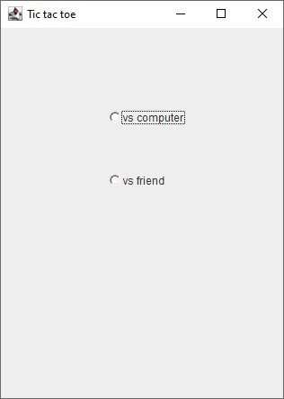
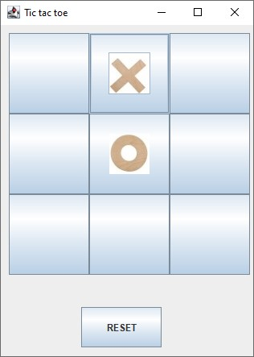
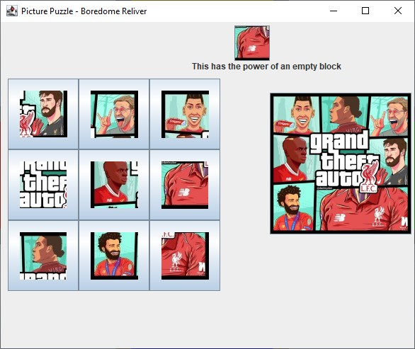
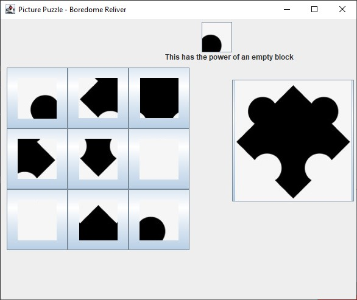
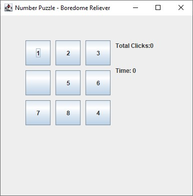
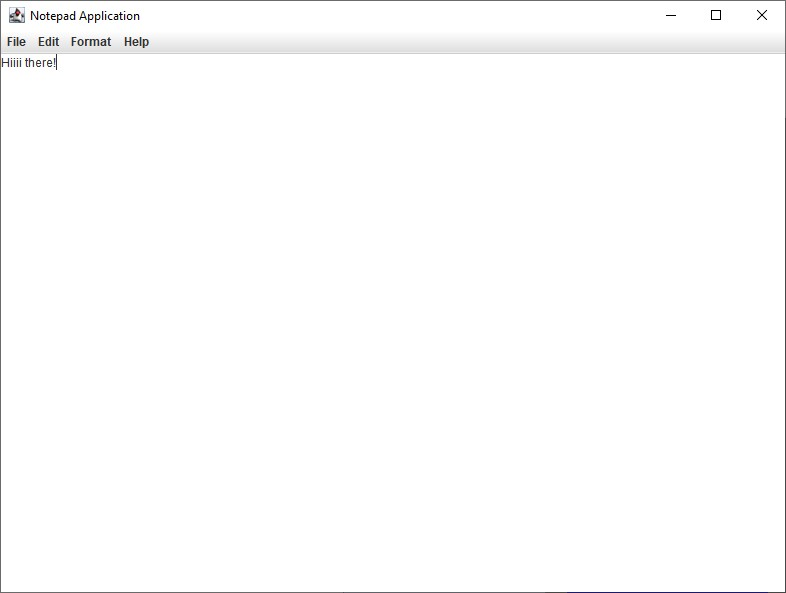

# Boredom-Reliever

A Collection of Games and Utilities💣 built using Java-Swing Framework😎 following the Model View Controller Architecture🧱.

Included Games:
- Tic Tac Toe
- Picture Puzzle
- Number Puzzle

Utilities:
- Notepad
- Calculator

Screenshots:

- Tic Tac Toe

    
    
 

- Picture Puzzle
  
    
    
  
- Number Puzzle

    
  
- Notepad

    
  
- Calculator

    
  
